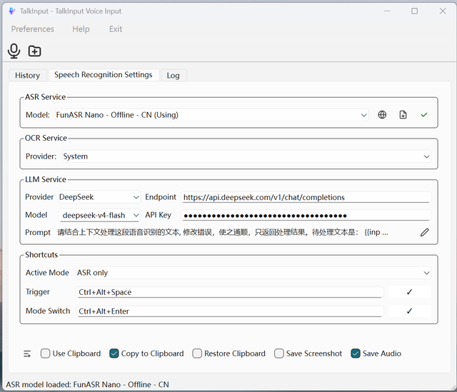
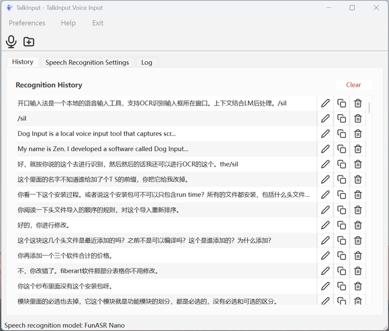
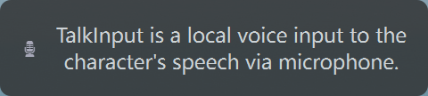

English | [简体中文](README.md)

# TalkInput

A local voice input tool that captures speech via microphone, performs OCR on the active input window for context, and uses LLM post-processing to correct recognition errors — results are automatically injected into any application's text field.

## Features

- **Multi-engine ASR** — Built-in support for Paraformer (streaming bilingual zh/en), SenseVoice (multilingual), FunASR Nano (600M params, hotwords support), and system-native speech recognition. Download and switch on demand.
- **LLM Post-processing** — Recognized text is refined by an LLM to fix typos, add punctuation, and improve phrasing using surrounding context. Supports local llama.cpp (auto-managed), DeepSeek, or any custom API endpoint.
- **OCR Context Awareness** — Before recognition, captures on-screen text near the focused input field as context, improving LLM correction accuracy.



- **Three Pipeline Modes** — Cycle through modes with the mode switch hotkey:
  - 🎙 — ASR only
  - 🎙✨ — ASR + LLM post-processing
  - 🎙✨📄 — ASR + LLM post-processing + OCR context (full pipeline)
- **Audio File Recognition** — Decode audio files (WAV, MP3, etc.) and transcribe them to text.
- **Recognition History** — All results saved in a local SQLite database. Browse, copy, edit, or delete entries.



- **Voice Overlay** — A floating text preview window appears during recording, showing real-time recognition progress and pipeline mode, auto-positioning on the active screen.



- **System Tray** — Minimize to tray, respond to hotkeys in the background. Optional start on boot.

## Usage

### Global Hotkeys

| Hotkey (configurable) | Action |
|---|---|
| `Ctrl+Alt+Space` | Start / stop voice input (uses current pipeline mode) |
| `Ctrl+Alt+Enter` | Cycle pipeline mode 🎙 → 🎙✨ → 🎙✨📄 |

Both hotkeys can be customized in the settings.

### Main Window

- **Toolbar** — "Start Recognition" button to begin/stop voice input. "Recognize File" to import audio files.
- **Settings** — Choose ASR engine, download models, manage hotwords, configure LLM endpoint.
- **History** — View, copy, edit, or delete all recognition records.
- **Log** — Runtime logs for troubleshooting.

### Audio File Recognition

Click "Recognize File" on the toolbar or select it from the menu to import audio files (WAV, MP3, M4A, etc.). The recognized text is displayed and saved to history.

## Installation

Download the pre-built NSIS installer from [GitHub Releases](https://github.com/ZenShawn/TalkInput/releases) and run it.

On first launch, choose and download a speech recognition model in Settings. The LLM model (llama.cpp) will be downloaded automatically on first use.

### Build from Source

**Prerequisites:**
- C++23 compiler (MSVC / Clang / GCC)
- [CMake](https://cmake.org/) ≥ 3.21
- [Qt 6](https://www.qt.io/) (Widgets / Core / Gui / Multimedia / Network / Svg / Sql)
- [vcpkg](https://github.com/microsoft/vcpkg) (libarchive, spdlog, nlohmann-json)
- [sherpa-onnx](https://github.com/k2-fsa/sherpa-onnx) v1.13.3 static library

```bash
git clone https://github.com/ZenShawn/TalkInput.git
cd TalkInput
cmake --preset release
cmake --build build
./build/bin/TalkInput
```

To package the installer

```bash
cd build
cpack
```

> The preset file contains Qt and vcpkg paths — edit `CMakePresets.json` to match your environment before building.

## Development

### Project Structure

```
src/                 — Application source
  recognizers/       — ASR engine implementations (Paraformer / SenseVoice / FunASR / System)
  windows/           — Windows-specific implementation
  linux/             — Linux-specific implementation
  macos/             — macOS-specific implementation
resources/           — Icons, stylesheets, default configuration
cmake/               — CMake modules
third_parties/       — Third-party libraries
  sherpa-onnx/       — sherpa-onnx SDK and headers
  KDToolBox/         — Utility library
```

## Credits

- [sherpa-onnx](https://github.com/k2-fsa/sherpa-onnx) — Offline speech recognition engine
- [Qt](https://www.qt.io/) — Cross-platform framework
- [QCoro](https://github.com/qcoro/qcoro) — C++ coroutine library
- [QHotkey](https://github.com/Skycoder42/QHotkey) — Global hotkey library

## License

[GNU General Public License v3.0](LICENSE)
