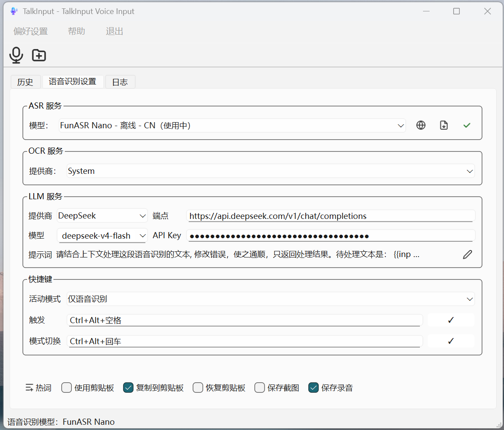
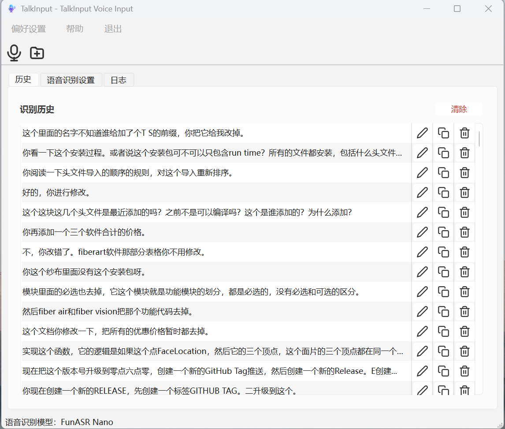

[English](README.en.md) | 简体中文

# TalkInput 语音输入法

本地语音输入工具，通过麦克风采集语音，支持 OCR 识别输入框所在窗口的文字作为上下文，结合 LLM 后处理修正识别错误，结果自动注入到任意应用程序的输入框。

<p align="center">
  
  &nbsp;&nbsp;&nbsp;
  
</p>

## 功能

- **多引擎语音识别** — 内置 Paraformer（流式中英双语）、SenseVoice（多语言）、FunASR Nano（600M 参数，支持热词）及系统原生语音识别，可按需下载切换。
- **LLM 后处理** — 识别文本经由 LLM 修正错别字、补全标点、结合上下文优化表达。支持本地 llama.cpp 服务（自动管理）或 DeepSeek 等云端 API，可配置自定义端点。
- **OCR 上下文感知** — 识别前自动截取当前输入框附近的屏幕文字作为上下文，提升 LLM 修正准确率。
- **三级流水线** — 依次为纯语音识别 → LLM 后处理 → OCR 上下文，通过快捷键循环切换：
  - 🎙 — 仅语音识别
  - 🎙✨ — 语音识别 + LLM 后处理
  - 🎙✨📄 — 语音识别 + LLM 后处理 + OCR 上下文（完整流水线）
- **音频文件识别** — 支持将音频文件（WAV、MP3 等）解码并识别为文字。
- **识别历史** — 所有识别结果自动存入本地 SQLite 数据库，支持浏览、复制、编辑、删除。

<p align="center">
  
</p>

- **语音覆盖层** — 录音时显示浮动文字预览窗口，实时展示识别进度与流水线模式，自动定位到当前屏幕。
- **系统托盘** — 最小化到系统托盘，后台响应快捷键，开机自启动可选。
- **中英文界面** — 支持简体中文和英文界面切换。

## 使用方法

### 全局快捷键

| 快捷键（可自定义） | 功能 |
|---|---|
| `Ctrl+Alt+Space` | 开始/停止语音输入（使用当前流水线模式） |
| `Ctrl+Alt+Enter` | 循环切换流水线模式 🎙 → 🎙✨ → 🎙✨📄 |

在设置界面中可以自定义这两个快捷键。

### 主窗口


- **工具栏** — 「开始识别」按钮启动/停止语音输入，「识别文件」导入音频文件。
- **设置** — 选择语音识别引擎、下载模型、管理热词、配置 LLM 端点。
- **历史** — 查看、复制、编辑、删除所有识别记录。
- **日志** — 查看运行日志，便于排查问题。

### 音频文件识别

点击工具栏「识别文件」按钮或菜单栏选择「识别文件」，导入 WAV、MP3、M4A 等常见格式的音频文件，识别结果将显示在窗口中并存入历史记录。

## 安装

从 [GitHub Releases](https://github.com/ZenShawn/TalkInput/releases) 下载预编译的 NSIS 安装包，运行安装即可。

首次启动后，在「设置」中选择语音识别模型并下载。LLM 模型（llama.cpp）也会在首次使用时自动下载。

### 从源码构建

**前置要求：**
- C++23 编译器（MSVC / Clang / GCC）
- [CMake](https://cmake.org/) ≥ 3.21
- [Qt 6](https://www.qt.io/) (Widgets / Core / Gui / Multimedia / Network / Svg / Sql)
- [vcpkg](https://github.com/microsoft/vcpkg)（管理 libarchive、spdlog、nlohmann-json）
- [sherpa-onnx](https://github.com/k2-fsa/sherpa-onnx) v1.13.3 静态库

**Windows (PowerShell):**
```powershell
git clone https://github.com/ZenShawn/TalkInput.git
cd TalkInput
cmake --preset release --fresh
cmake --build build
.\build\bin\TalkInput.exe
```

打包安装程序：

```powershell
cd build
cpack
```

## 开发

### 项目结构

```
src/                 — 应用源码
  recognizers/       — ASR 引擎实现（Paraformer / SenseVoice / FunASR / System）
  windows/           — Windows 平台特定实现
  linux/             — Linux 平台特定实现
  macos/             — macOS 平台特定实现
resources/           — 图标、样式表、默认配置
cmake/               — CMake 模块
third_parties/       — 第三方库
  sherpa-onnx/       — sherpa-onnx SDK 及头文件
  KDToolBox/         — 工具库
```

### 技术栈

| 依赖 | 用途 |
|------|------|
| Qt 6 | GUI、音频采集、网络、SQLite |
| [sherpa-onnx](https://github.com/k2-fsa/sherpa-onnx) | 离线语音识别 |
| [llama.cpp](https://github.com/ggml-org/llama.cpp) | 本地 LLM 推理服务 |
| [QCoro](https://github.com/qcoro/qcoro) | C++20 协程 |
| [QHotkey](https://github.com/Skycoder42/QHotkey) | 全局热键 |
| [spdlog](https://github.com/gabime/spdlog) | 日志 |
| [nlohmann/json](https://github.com/nlohmann/json) | JSON 解析 |
| [libarchive](https://github.com/libarchive/libarchive) | 模型压缩包解压 |

### 翻译

```powershell
pwsh msvc.ps1 cmake --build build -t update_translations
```

随后编辑 `src/TalkInput_zh.ts` 中的未完成条目。

### 代码风格

- C++23 标准，不使用平台宏，平台相关代码分目录存放。
- 源文件为 UTF-8 编码，直接使用 UTF-8 字符。

## 致谢

- [sherpa-onnx](https://github.com/k2-fsa/sherpa-onnx) — 离线语音识别引擎
- [llama.cpp](https://github.com/ggml-org/llama.cpp) — 本地 LLM 推理
- [Qt](https://www.qt.io/) — 跨平台框架
- [QCoro](https://github.com/qcoro/qcoro) — C++ 协程库
- [QHotkey](https://github.com/Skycoder42/QHotkey) — 全局热键库

## 许可证

[GNU General Public License v3.0](LICENSE)
